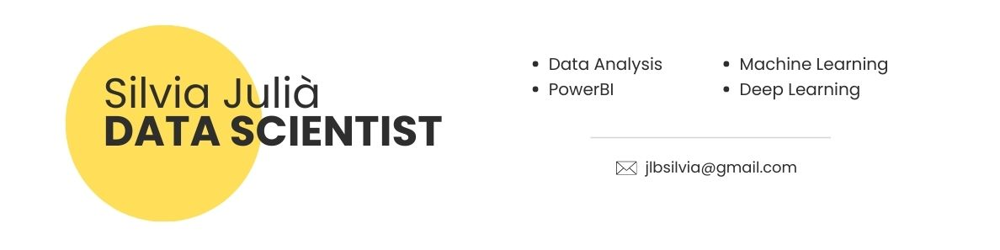

<!-- Banner -->

# Hola, soy Silvia, Data Scientist! 👋

¡Bienvenido a mi perfil! Actualmente estoy buscando oportunidades para aplicar y desarrollar mis habilidades en el campo de la ciencia de datos.

## Habilidades

- **Python:** Incluyendo Numpy, Pandas, Scikit-learn
- **SQL**
- **Preprocesamiento de Datos**
- **Visualización de Datos:** PowerBI, Matplotlib, Seaborn
- **Herramientas de colaboración:** Git, Jupyter Notebooks, Collab
- **Machine Learning**
- **Deep Learning:** TensorFlow
- **Procesamiento de Lenguaje Natural (NLP)**
- **Computer Vision**
- **Optimización de Modelos**
- **Comprensión de Negocios y Comunicación Efectiva de Resultados**

## Educación

- **Data Analytics certificate:** Coursera
- **Máster en Data Science:** Nulcio Digital School

## Contacto
- 📫 Correo Electrónico: **jlbsilvia@gmail.com**
- 🔗LinkedIn: [Silvia Data Analyst](https://www.linkedin.com/in/silvia-data-analyst)

<!--
**silviajlb/silviajlb** is a ✨ _special_ ✨ repository because its `README.md` (this file) appears on your GitHub profile.

Here are some ideas to get you started:

- 🔭 I’m currently working on ...
- 🌱 I’m currently learning ...
- 👯 I’m looking to collaborate on ...
- 🤔 I’m looking for help with ...
- 💬 Ask me about ...
- 📫 How to reach me: ...
- 😄 Pronouns: ...
- ⚡ Fun fact: ...

